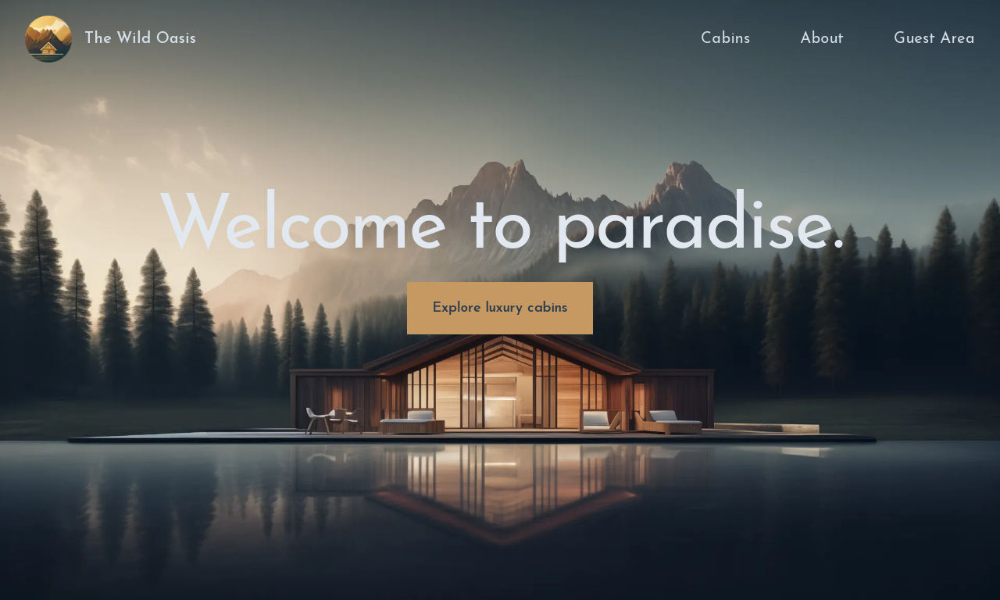

<div align="center">


# The Wild Oasis - Booking

### [**Live Site**](https://the-wild-oasis-booking-salem.vercel.app)

[Report Bug](https://github.com/AbdelrahmanSalemQotb/the-wild-oasis-booking/issues)
•
[Request Feature](https://github.com/AbdelrahmanSalemQotb/the-wild-oasis-booking/pulls)

   <hr>
   
[](https://www.linkedin.com/in/abdelrahman-salem-qotb)


</div>

## Description

Welcome to **The Wild Oasis - Booking**! This fully responsive application allows users to explore, book, and manage stays at a beautiful cabin retreat. Designed for convenience and ease, this app provides a seamless booking experience with user-friendly features.

[](https://the-wild-oasis-booking-salem.vercel.app)

## Admin Version

An admin version of this application is available for managing cabins, bookings, and users:

- [GitHub Repository](https://github.com/AbdelrahmanSalemQotb/The-Wild-Oasis)
- [Live Site](https://the-wild-oasis-salem.vercel.app/)

## Features

- 🏠**Browse Cabins**: View detailed descriptions and images of all available cabins.
- 📅**Booking System**: Book a cabin based on availability and the number of guests.
- 🔐**User Authentication**: Sign in using Google to manage bookings.
- 📋**Manage Bookings**: View, edit, or cancel your bookings easily.
- 👤**Profile Management**: Update your profile information directly within the app.
- 📱**Responsive Design**: Fully optimized for all devices, ensuring a smooth user experience on mobile, tablet, and desktop.

## Technologies Used

- **Next.js** (App Router)
- **Tailwind CSS** for styling
- **Supabase** for the database (shared with the admin app)
- **NextAuth.js** for authentication (Google sign-in)
- **Date-fns** for date handling

## Setup Instructions

To run this project locally:

1. **Clone the repository:**
   First, clone the repository to your local machine using the following command:

   ```bash
   git clone https://github.com/AbdelrahmanSalemQotb/the-wild-oasis-booking
   ```

2. **Install dependencies:**
   Navigate into the project directory and install the necessary dependencies:

   ```bash
   cd the-wild-oasis-booking
   npm install
   ```

3. **Configure environment variables:**
   Create a `.env.local` file in the root of the project and add the following environment variables:

   - `SUPABASE_URL`: The URL of your Supabase instance. [Get it from your Supabase dashboard](https://app.supabase.io).
   - `SUPABASE_KEY`: Your Supabase service key. [Find it in your Supabase dashboard](https://app.supabase.io).
   - `NEXTAUTH_URL`: The base URL of your app (e.g., `http://localhost:3000` for local development).
   - `NEXTAUTH_SECRET`: You can generate a secret key at [auth-secret-gen.vercel.app](https://auth-secret-gen.vercel.app/).
   - `AUTH_GOOGLE_ID`: Your Google OAuth client ID. [Get it from the Google Developer Console](https://console.developers.google.com).
   - `AUTH_GOOGLE_SECRET`: Your Google OAuth client secret. [Get it from the Google Developer Console](https://console.developers.google.com).

   Example `.env.local`:

   ```bash
   SUPABASE_URL=your-supabase-url
   SUPABASE_KEY=your-supabase-key
   NEXTAUTH_URL=http://localhost:3000
   NEXTAUTH_SECRET=your-nextauth-secret
   AUTH_GOOGLE_ID=your-google-client-id
   AUTH_GOOGLE_SECRET=your-google-client-secret
   ```

   **Where to get the values:**

   - **SUPABASE_URL & SUPABASE_KEY**:
     Go to your Supabase project.
     From the Settings > API, you can find your Project URL (`SUPABASE_URL`) and API Key (`SUPABASE_KEY`).

   - **NEXTAUTH_URL & NEXTAUTH_SECRET**:

     - `NEXTAUTH_URL` is usually your app's URL in development (`http://localhost:3000`).
     - For `NEXTAUTH_SECRET`, you can generate a secure secret using this [website](https://auth-secret-gen.vercel.app/). Simply visit the link, and it will generate a random secret for you to use.

   - **AUTH_GOOGLE_ID & AUTH_GOOGLE_SECRET**:
     Go to the Google Developer Console.
     - Create a new project (or select an existing one).
     - Navigate to Credentials > Create Credentials > OAuth 2.0 Client IDs.
     - Under the Authorized JavaScript origins, add `http://localhost:3000` (for local development).
     - Under Authorized redirect URIs, add `http://localhost:3000/api/auth/callback/google`.
     - Copy the Client ID (`AUTH_GOOGLE_ID`) and Client Secret (`AUTH_GOOGLE_SECRET`).

4. **Start the development server:**
   After configuring the environment variables, you can start the development server by running:

   ```bash
   npm run dev
   ```

5. **Open the application:**
   Open your browser and visit [http://localhost:3000](http://localhost:3000) to view the application.

---

### Database Setup

If you are using **Supabase** for the database, follow these steps to set up the required tables:

- **Create the following tables** in your Supabase project (You can use the SQL editor in Supabase or a database client):

  - **bookings table**
  - **cabins table**
  - **guests table**
  - **settings table**

  The full SQL to create the tables can be found in the **Supabase Tables** section of this README.

  > **Important Note:** The **admin version** and **customer version** share the same database tables. If you've already created the tables for the admin version, you do **not need to create them again** for the customer version.

---

### Additional Setup for Google Authentication

1. **Set up OAuth credentials in the Google Developer Console:**
   - Go to the [Google Developer Console](https://console.developers.google.com).
   - Create a new project or use an existing one.
   - In the left sidebar, navigate to **APIs & Services > Credentials**.
   - Click on **Create Credentials** and select **OAuth 2.0 Client IDs**.
   - Add your app's authorized JavaScript origin (e.g., `http://localhost:3000` for local development) and the redirect URI (e.g., `http://localhost:3000/api/auth/callback/google`).
   - Note down the **Client ID** and **Client Secret** and add them to your `.env.local` file as `AUTH_GOOGLE_ID` and `AUTH_GOOGLE_SECRET`.

---

### Running the Application on Production

1. **Deploying the application:**
   When ready for production, you can deploy the app using your preferred hosting service (e.g., Vercel, Netlify, etc.). Ensure that all environment variables are set correctly in your hosting provider’s environment settings.

2. **Domain setup:**
   If you deploy to a custom domain, update the `NEXTAUTH_URL` in the `.env.local` file to match the live URL of the app.

3. **Update Google OAuth credentials:**
   - When moving to production, go to the [Google Developer Console](https://console.developers.google.com).
   - Navigate to **APIs & Services > Credentials**.
   - Update your **Authorized JavaScript origins** to include the production domain (e.g., `https://yourdomain.com`).
   - Update the **Authorized redirect URIs** to include the production callback URL (e.g., `https://yourdomain.com/api/auth/callback/google`).
   - Save the changes and make sure that the **AUTH_GOOGLE_ID** and **AUTH_GOOGLE_SECRET** in your `.env.local` file are updated accordingly.

---

## Supabase Tables

Here are the SQL table definitions used for managing bookings, cabins, guests, and settings:

### Cabins Table

```sql
create table public.cabins (
  id bigint generated by default as identity not null,
  created_at timestamp with time zone not null default now(),
  name text null,
  "maxCapacity" smallint not null,
  "regularPrice" smallint not null,
  discount smallint not null default '0'::smallint,
  description text null,
  image text null,
  constraint cabins_pkey primary key (id),
  constraint cabins_id_key unique (id)
);
```

### Guests Table

```sql
create table public.guests (
  id bigint generated by default as identity not null,
  created_at timestamp with time zone not null default now(),
  "fullName" text not null,
  email text not null,
  "nationalID" text null,
  nationality text null,
  "countryFlag" text null,
  constraint guests_pkey primary key (id),
  constraint guests_id_key unique (id),
  constraint unique_email unique (email)
);
```

### Bookings Table

```sql
create table public.bookings (
  id bigint generated by default as identity not null,
  created_at timestamp with time zone not null default now(),
  "startDate" timestamp without time zone not null,
  "endDate" timestamp without time zone not null,
  "numNights" smallint not null,
  "numGuests" smallint not null,
  "cabinPrice" real not null,
  "extrasPrice" real not null default '0'::real,
  "totalPrice" real not null,
  status text not null,
  "hasBreakfast" boolean not null default false,
  "isPaid" boolean not null default false,
  observations text null,
  "guestId" bigint not null,
  "cabinId" bigint not null,
  constraint boookings_pkey primary key (id),
  constraint bookings_id_key unique (id),
  constraint bookings_cabinId_fkey foreign key ("cabinId") references cabins (id),
  constraint bookings_guestId_fkey1 foreign key ("guestId") references guests (id)
);
```

### Settings Table

```sql
create table public.settings (
  id bigint generated by default as identity not null,
  created_at timestamp with time zone not null default now(),
  "minBookingLength" smallint not null,
  "maxBookingLength" smallint not null,
  "maxGuestsPerBooking" smallint not null,
  "breakfastPrice" real not null,
  constraint Settings_pkey primary key (id),
  constraint settings_id_key unique (id)
);
```

## Important Note:

- The **admin version** and **customer version** share the same database tables. If you’ve already created the tables in the admin version, you do not need to create them again for the customer version.

## Author

### Abdelrahman Salem

<div align="center">

[](https://github.com/AbdelrahmanSalemQotb)
[](https://www.linkedin.com/in/abdelrahman-salem-qotb)

</div>

> Feel free to reach out for questions, collaborations, or discussions about the project!

## Acknowledgments

Special thanks to Jonas Schmedtmann for the comprehensive Udemy course that guided the development of this project.
